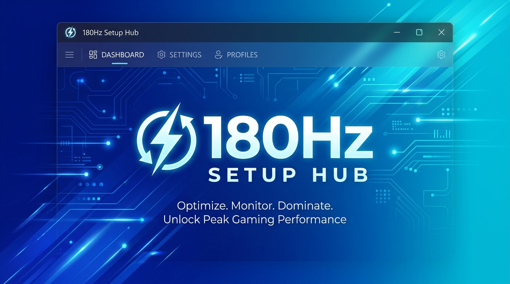

<p align="center">
  
</p>

<h1 align="center">180Hz Setup Hub</h1>

<p align="center">
  <strong>The Ultimate Windows Post-Install &amp; Gaming Optimization Setup Assistant</strong>
</p>

<p align="center">
  <a href="https://github.com/tanjeem180hz/180HzSetupHub/releases/latest"></a>
  <a href="https://github.com/tanjeem180hz/180HzSetupHub/releases/latest"></a>
  <a href="https://github.com/tanjeem180hz/180HzSetupHub/releases/latest"></a>
  <a href="https://github.com/tanjeem180hz/180HzSetupHub/releases/latest"></a>
  <a href="https://github.com/tanjeem180hz/180HzSetupHub/blob/main/SECURITY.md"></a>
</p>

---

## ⚡ 1-Click Direct Downloads

Choose your preferred installation method below:

| Package | Size | Description | Download Link |
| :--- | :--- | :--- | :--- |
| **🚀 Web Bootstrapper (Recommended)** | **~2 MB** | Ultra-lightweight Windows App Installer. Includes dynamic speed meter, automatic prerequisites check, and self-repair. | [**Download 180HzSetupHubSetup.exe**](https://github.com/tanjeem180hz/180HzSetupHub/releases/latest/download/180HzSetupHubSetup.exe) |
| **📦 Standalone Full Package** | **~68 MB** | Complete self-contained single-file binary. Perfect for offline machines or portable USB drives. | [**Download 180HzSetupHub.exe**](https://github.com/tanjeem180hz/180HzSetupHub/releases/latest/download/180HzSetupHub.exe) |

### 💻 1-Click PowerShell Terminal Install (No Browser Needed)

Open **PowerShell** and run this single command to download and launch the installer instantly:

```powershell
irm https://raw.githubusercontent.com/tanjeem180hz/180HzSetupHub/main/scripts/install.ps1 | iex
```

---

## 🌟 Key Features

### 🎨 Windows 10/11 Native App Installer Experience
* **100% Native Design:** Replicates the official Microsoft Store / MSIX desktop app installer dialog with clean Segoe UI typography, blue **Trusted App** badge, and standard titlebar controls.
* **Auto-Launch:** Automatically starts the app when installation completes with the `[✓] Launch when ready` option.
* **Zero Runtime Overhead:** Installer runs on native .NET Framework 4.8 preinstalled in Windows, guaranteeing instant startup with 0 crash risk and 0 missing dependency prompts.

### 📶 Real-Time Dynamic Download Speed Meter
* Accurately tracks active network throughput during package downloads.
* Dynamically scales unit prefixes in real-time according to speed:
  * Low / Mobile: `650.4 KB/s`
  * Broadband: `14.2 MB/s`
  * Gigabit Fiber: `1.1 GB/s`

### 🛠️ Built-in Repair & Self-Healing Diagnostics
* The Modify / Uninstall wizard includes an active **Repair** mode.
* **One-Click Fix:** Reinstalls corrupt executables, clears deadlocks/temporary files, resets broken package catalogs, repairs PowerShell execution policies, and restores Desktop and Start Menu shortcuts without losing custom user settings.

### 📦 Modern Windows Package Manager (`winget`) Engine
* Resolves software directly through Microsoft's official Windows Package Manager repository for guaranteed security, authentic hashes, and latest versions.
* Automatic silent prerequisite installation of `winget` from Microsoft servers if absent on the system.

### 🎯 Curated Profiles for Quick Setup
* **Gamers & Enthusiasts:** Discord, Steam, Epic Games, OBS Studio, MSI Afterburner, GPU drivers, and performance runtimes.
* **Developers:** VS Code, Git, Windows Terminal, Node.js, Python, Docker, DBeaver.
* **Productivity & Office:** 7-Zip, Everything, PowerToys, Notepad++, VLC, Chrome, Firefox.

---

## 🖥️ System Requirements

* **Operating System:** Windows 10 (version 1903 or later) / Windows 11 (64-bit).
* **RAM:** 2 GB minimum (4 GB recommended).
* **Disk Space:** ~150 MB free disk space.
* **Internet Connection:** Required for package catalog updates and app downloads.

---

## 📁 Installation Directory & Paths

By default, 180Hz Setup Hub installs in user-space without cluttering system folders:

```text
%LOCALAPPDATA%\Programs\180Hz Setup Hub\
├── 180HzSetupHub.exe          # Main application executable
├── Uninstall.exe              # Uninstaller & Repair wizard
├── Configuration\
│   ├── packages.default.json  # Curated default package catalog
│   └── appsettings.default.json
└── Data\
    ├── config\                # User-modified catalog & settings
    ├── downloads\             # Cached downloads
    └── logs\                  # Session diagnostic logs
```

---

## 🛠️ Adding Custom Apps to the Catalog

You can easily expand the catalog by adding custom apps to:

```text
%LOCALAPPDATA%\Programs\180Hz Setup Hub\Data\config\packages.json
```

Add an entry with this structure:

```json
{
  "id": "Google.Chrome",
  "name": "Google Chrome",
  "category": "Browsers",
  "description": "Fast and secure web browser by Google.",
  "iconUrl": "https://www.google.com/s2/favicons?domain=google.com&sz=128",
  "accentColor": "#4285F4",
  "essential": true
}
```

> **Tip:** You can discover any Windows Package ID using PowerShell:
> ```powershell
> winget search "app name"
> ```

---

## 🔨 Building from Source

### Prerequisites
* [.NET 8.0 SDK](https://dotnet.microsoft.com/download/dotnet/8.0)
* PowerShell 5.1+ or PowerShell 7+

### 1-Click Complete Build
Run the automated build script to compile both the application and the 2 MB installer:

```powershell
powershell.exe -ExecutionPolicy Bypass -File scripts\Build-Installer.ps1
```

The compiled binaries will be output to:
* **Installer:** `artifacts\installer\180HzSetupHubSetup.exe` (~1.93 MB)
* **App Binary:** `artifacts\publish\win-x64\180HzSetupHub.exe` (~68 MB)

---

## 🔒 Security & Integrity

180Hz Setup Hub enforces strict package validation, sanitized argument parsing, and isolated process execution:
* See [`SECURITY.md`](SECURITY.md) for full threat models and security policies.
* See [`docs/ARCHITECTURE.md`](docs/ARCHITECTURE.md) for code structure, runtime lifecycle, and architectural details.

---

<p align="center">
  Developed with ❤️ by <a href="https://github.com/tanjeem180hz"><strong>Muhammad Tanjeem (180Hz)</strong></a>
</p>
